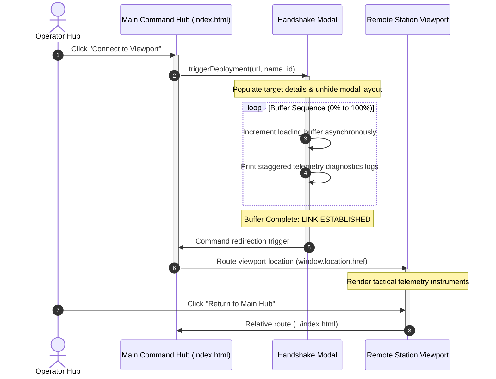

# Cosmic Ops: Ground Control // Core System Manual

> **SECURITY LEVEL:** CLASS-4 AUTHENTICATED COMMAND ACCESS  
> **REVISION:** SYSTEM OPERATING PROTOCOL v4.02  
> **LAST SYNCHRONIZED:** UTC 2026-05-20

---

## 📡 1. Overview: Multi-Station Telemetry Handshake Flow

The **Cosmic Ops: Ground Control** system utilizes an asynchronous, multi-stage handshake flow to establish high-fidelity orbital viewport links to remote surface installations. This sequence is designed to simulate a military-grade secure telemetry sync:



### Protocol Execution Details
1. **Initiation:** The operator triggers connection on a sector array (e.g., Mauna Kea Observatory).
2. **Tunnel Authentication:** The system launches `#deployment-modal`, initializing remote handshakes.
3. **Telemetry Buffered:** Simulated data packets increase systematically. Corresponding diagnostic logs reveal stage thresholds (e.g., port multiplexer validations, secure buffer allocation).
4. **Routing Transition:** After reaching 100%, the interface executes a clean browser-level route transition directly to the targeted operations split view.
5. **Session Termination:** Standard relative pathing (`../index.html`) permits hot-reconnection, returning users back to the master command directory without state loss.

---

## 📂 2. Structural Tree Map

Below is the directory structure of the Cosmic Operations Ground Control interface modules:

```
stitch-cosmic-ops/
├── README.md                                  # Core System Operating Manual
├── index.html                                 # Master Command Hub & Selector Hub
├── assets/
│   └── shared-styles.css                      # Unified styles, 40px grid mesh, and 4px boundary overrides
├── deployment_transition_modal/               # Modal resources and asset files
│   └── (supporting assets)
├── mauna_kea_operations_split_view/
│   └── code.html                              # Adaptive optics & Laser Guide Star viewport
├── bosscha_observatory_operations_split_view/
│   ├── code.html                              # Historic Zeiss refractor & Bortle scale tracker
│   └── screen.png                             # Port visual interface preview
└── atacama_desert_operations_split_view/
    ├── code.html                              # Interferometry correlator pipeline viewport
    └── screen.png                             # Port visual interface preview
```

### Module Descriptions
* **`index.html`:** Host file managing the master telemetry, satellite downlinks, global logs, and the central system handshake sequencer.
* **`assets/shared-styles.css`:** Imposes strict visual parameters, ensuring matching background grids, layout radii, and glassmorphism transparency filters.
* **`*_operations_split_view/code.html`:** Standalone dashboard nodes featuring custom station readouts, real-time wave error models, skyglow trackers, and dynamic telemetry arrays.

---

## ⚡ 3. Quick Installation & Setup

Cosmic Ops runs as a lightweight, client-side web application. It requires no heavy backends, package management installation pools, or server compilation scripts.

### 🌐 Referencing Observatory Viewports in index.html

Individual sector cards on the Main Command Hub trigger navigation by calling the global `triggerDeployment` JavaScript routine. Buttons are formatted to pass targeted folder paths as shown below:

```html
<!-- Example Sector Card Connection Trigger -->
<button onclick="triggerDeployment('mauna_kea_operations_split_view/code.html', 'MAUNA KEA OBSERVATORY', 'MK-OBS-01')">
    CONNECT TO VIEWPORT
</button>
```

The script manages the interactive handshake buffer and ultimately redirects the window:

```javascript
function triggerDeployment(targetUrl, targetName, targetId) {
    // ... telemetry loading logic ...
    setTimeout(() => {
        window.location.href = targetUrl; // Redirects smoothly to viewport code.html
    }, 4000);
}
```

### 💻 Running the Command Hub Locally

To view the application with all dynamic assets rendering properly, host the directory using any static web server:

#### Option A: Python HTTP Server (Recommended)
```powershell
# Run from the root directory
python -m http.server 8000
```
Then access the terminal launcher at `http://localhost:8000`.

#### Option B: NodeJS Static Server
```powershell
# Install and run local static server
npx -y http-server -p 8000
```

---

```
[SYSTEM NOTICE: MASTER COORDINATOR SECURED]
// END OF SYSTEM MANUAL //
```
